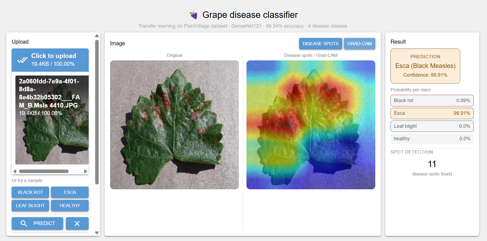
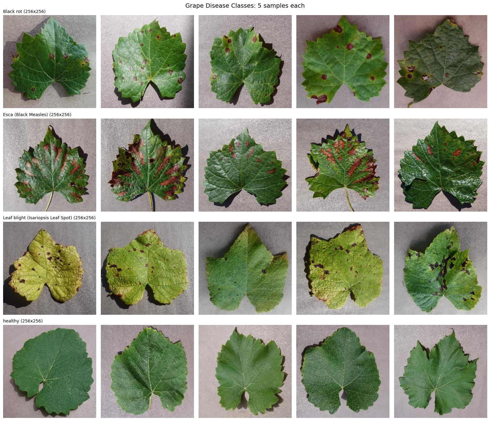
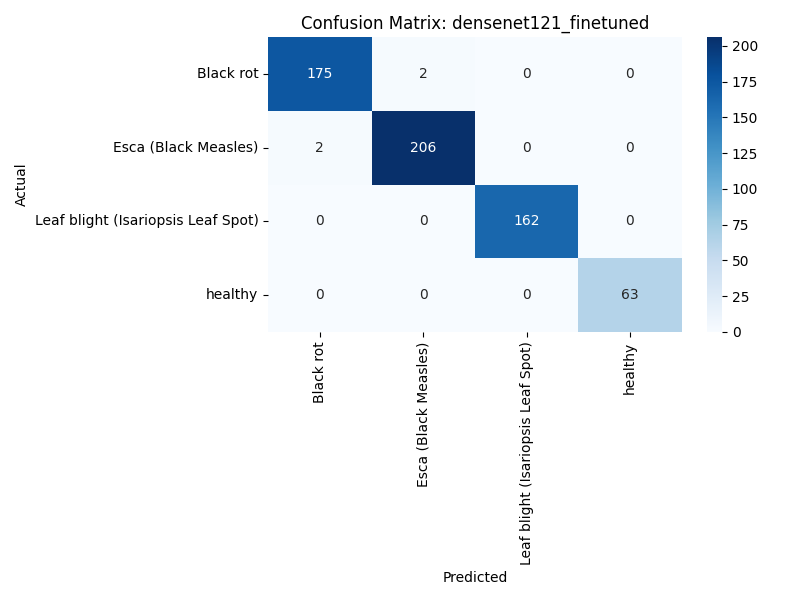
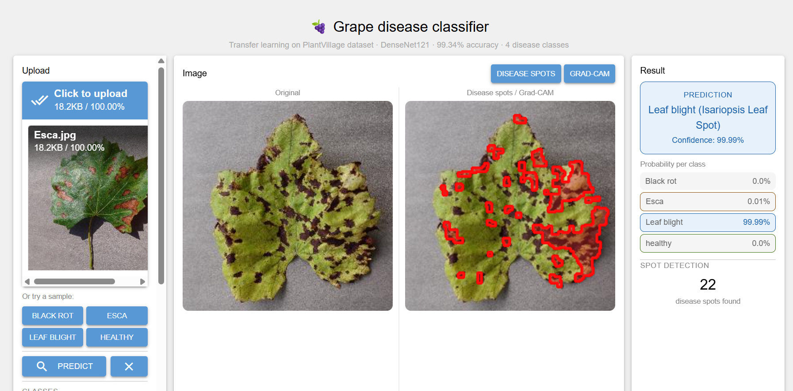
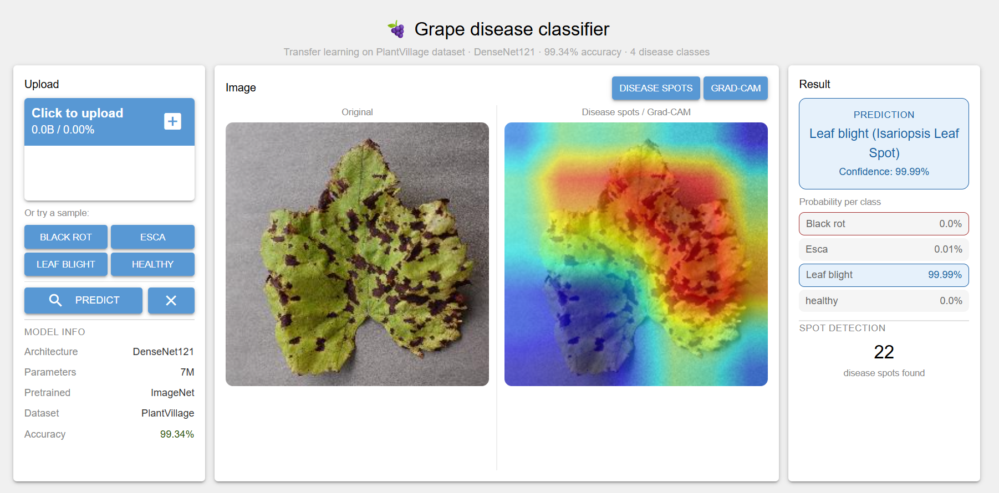

<div align="center">

# 🍇 Grape Disease Classifier

A deep learning application that classifies grape leaf diseases using transfer learning. Trained on the PlantVillage dataset and deployed as an interactive web application with a REST API backend. The application provides disease classification, confidence scores, OpenCV based disease spot detection with contour outlining, and Grad-CAM++ heatmap visualization showing which regions of the leaf the model focused on when making its prediction.

[](https://python.org)
[](https://pytorch.org)
[](https://fastapi.tiangolo.com)
[](https://nicegui.io)
[](https://docker.com)
[](https://huggingface.co/spaces/harman2993/grape-disease-classifier)
[](LICENSE)

[](https://github.com/harmandeep2993/grape-disease-classifier)
[](https://github.com/harmandeep2993/grape-disease-classifier)
[](https://github.com/harmandeep2993/grape-disease-classifier)
[](https://github.com/harmandeep2993/grape-disease-classifier)
[](https://github.com/harmandeep2993/grape-disease-classifier)
[](https://github.com/harmandeep2993/grape-disease-classifier)
[](https://github.com/harmandeep2993/grape-disease-classifier)
[](https://github.com/harmandeep2993/grape-disease-classifier)

**[🚀 Live Demo](https://huggingface.co/spaces/harman2993/grape-disease-classifier)**

</div>

---

## Problem Statement

Grape diseases cause significant crop losses worldwide and early detection is critical for effective treatment. Traditional disease identification relies on expert knowledge which is not always accessible to farmers especially in remote areas. Manual inspection is time consuming, subjective and prone to error.

This project addresses the problem by building an automated image classification system that can identify grape leaf diseases from a photograph. The goal is to provide an accurate, fast and accessible tool that any farmer or agricultural professional can use without specialist knowledge.

---

## Overview

This project detects four grape leaf conditions from an uploaded image:

- Black rot
- Esca (Black Measles)
- Leaf blight (Isariopsis Leaf Spot)
- Healthy

The best model (DenseNet121 fine-tuned) achieves **99.34% test accuracy** with only 4 mistakes out of 610 test images.



---

## Features

- Upload any grape leaf image or choose from built-in sample images
- Instant disease classification with confidence scores per class
- Disease spot detection using OpenCV color thresholding — outlines affected areas in red
- Grad-CAM++ heatmap visualization showing which regions the model focused on
- Split view showing original image alongside disease spots or Grad-CAM
- Single page layout with no scrolling required
- REST API with FastAPI for programmatic access

---

## Project Structure

```
grape-disease-classifier/
├── api/
│   └── main.py              # FastAPI prediction endpoint
├── frontend/
│   └── app.py               # NiceGUI web interface
├── src/
│   ├── data/
│   │   └── transforms.py    # Image preprocessing pipeline
│   ├── models/
│   │   ├── model.py         # Model architecture definitions
│   │   └── predict.py       # Inference logic
│   └── utils/
│       ├── gradcam.py        # Grad-CAM++ heatmap generation
│       └── disease_detector.py  # OpenCV disease spot detection
├── test_images/             # Sample images for each class
├── notebooks/               # Colab training notebooks
├── models/                  # Saved model weights (not in repo)
├── Dockerfile               # Container configuration
├── requirements.txt         # Python dependencies
└── README.md
```

---

## Dataset

**PlantVillage Dataset** — grape subset only

| Class | Images |
|---|---|
| Black rot | 1180 |
| Esca (Black Measles) | 1383 |
| Leaf blight | 1076 |
| Healthy | 423 |
| **Total** | **4062** |

The dataset is split into 70% train, 15% validation and 15% test using stratified sampling to preserve class distribution across all splits.


---

## Model

Three pretrained ImageNet models were compared using transfer learning:

| Model | Val Accuracy | Fine-tuned Accuracy |
|---|---|---|
| EfficientNet-B0 | 97.87% | 98.52% |
| ResNet50 | 98.03% | 99.18% |
| DenseNet121 | 98.52% | **99.18%** |

**DenseNet121** was selected as the final model. It matches ResNet50 accuracy but has 3x fewer parameters (7M vs 23M), making it faster and lighter for deployment.

### Training Approach

Training was done in two phases:

**Phase 1 — Feature extraction:** The backbone is frozen and only the classifier head (5K parameters) is trained for around 10 epochs. This gives the model a strong starting point quickly.

**Phase 2 — Fine-tuning:** The last 20% of backbone layers are unfrozen and trained with a much lower learning rate (0.00001) for around 15 epochs. This allows the model to adapt its high-level features specifically to grape disease patterns.

### Hyperparameters

| Parameter | Value |
|---|---|
| Optimizer | Adam |
| Learning rate (feature extraction) | 0.001 |
| Learning rate (fine-tuning) | 0.00001 |
| Scheduler | CosineAnnealingLR |
| Batch size | 32 |
| Early stopping patience | 5 |
| Image size | 224x224 |

---

## Results

Confusion matrix on test set (610 images):

| | Black rot | Esca | Leaf blight | Healthy |
|---|---|---|---|---|
| Black rot | 175 | 2 | 0 | 0 |
| Esca | 2 | 206 | 0 | 0 |
| Leaf blight | 0 | 0 | 162 | 0 |
| Healthy | 0 | 0 | 0 | 63 |

Leaf blight and Healthy achieved zero mistakes. The only 4 errors occur between Black rot and Esca which are visually similar diseases that even human experts sometimes confuse.



---

## Visualizations

### Disease Spot Detection

OpenCV color thresholding detects and outlines disease spots directly on the leaf image. Dark brown and rust colored regions are identified and outlined in red with a semi-transparent fill showing the extent of infection.



### Grad-CAM++

Grad-CAM++ generates a heatmap showing which regions of the image the model focused on when making its prediction. Red areas indicate high attention. This confirms the model is learning genuine disease features rather than background artifacts.


---

## Limitations

**Dataset scope:** The model is trained exclusively on PlantVillage images taken under controlled laboratory conditions. Performance on real-world field photographs may be lower due to varying lighting, angles and image quality.

**Class imbalance:** The Healthy class has only 423 images compared to 1383 for Esca. Although stratified splitting and augmentation were used to mitigate this, the model has seen fewer examples of healthy leaves during training.

**Limited disease coverage:** The model only recognises four conditions. Other grape diseases such as powdery mildew or downy mildew are not covered. Uploading an image of an unrecognised disease will still produce a prediction for one of the four known classes.

**No severity assessment:** The model predicts the disease class but does not assess the severity or extent of infection on the leaf.

**Single leaf input:** The model expects a clear close-up image of a single leaf. Images containing multiple leaves, branches or other objects may produce unreliable predictions.

---

## Tech Stack

| Layer | Technology |
|---|---|
| Model training | PyTorch, torchvision |
| Disease spot detection | OpenCV |
| Model interpretability | Grad-CAM++ |
| API | FastAPI |
| Frontend | NiceGUI |
| Deployment | Hugging Face Spaces via Docker |
| Package management | uv |

---

## Local Setup

### Prerequisites

- Python 3.12
- uv

### Installation

```bash
git clone https://github.com/harmandeep2993/grape-disease-classifier
cd grape-disease-classifier
uv sync
```

### Download the model

The trained model is not included in this repository due to file size. Follow these steps to download it from the Hugging Face Space:

**Option 1 — Manual download**

1. Go to the [Hugging Face Space files](https://huggingface.co/spaces/harman2993/grape-disease-classifier/tree/main)
2. Open the `models` folder
3. Click on `densenet121_finetuned_best.pth`
4. Click the download button
5. Place the file in your local `models/` folder

**Option 2 — Python script**

Create a file called `download_model.py` in the project root:

```python
from huggingface_hub import hf_hub_download

path = hf_hub_download(
    repo_id="harman2993/grape-disease-classifier",
    filename="models/densenet121_finetuned_best.pth",
    repo_type="space",
    local_dir="."
)
print(f"Model saved to: {path}")
```

Then run:

```bash
uv run python download_model.py
```

### Environment variables

Create a `.env` file in the project root:

```env
API_URL=http://127.0.0.1:8000
```

### Run locally

Start the API in one terminal:

```bash
uv run uvicorn api.main:app --reload
```

Start the frontend in another terminal:

```bash
uv run python frontend/app.py
```

Open `http://localhost:8080` in your browser.

---

## API

| Endpoint | Method | Description |
|---|---|---|
| `/health` | GET | Health check |
| `/predict` | POST | Upload image and get prediction |

### Example request

```bash
curl -X POST "http://localhost:8000/predict" \
     -F "file=@test_images/Healthy.jpg"
```

### Example response

```json
{
  "prediction": "healthy",
  "confidence": 99.34,
  "probabilities": {
    "Black rot": 0.21,
    "Esca (Black Measles)": 0.23,
    "Leaf blight (Isariopsis Leaf Spot)": 0.22,
    "healthy": 99.34
  },
  "spot_count": 0,
  "annotated": "<base64 encoded PNG>",
  "gradcam": "<base64 encoded PNG>"
}
```

---

## Docker

Build and run locally:

```bash
docker build -t grape-disease-classifier .
docker run -p 8080:8080 grape-disease-classifier
```

---

## Author

**Harmandeep Singh** | Data Science and AI/ML

[](https://github.com/harmandeep2993)
[](https://huggingface.co/harman2993)
